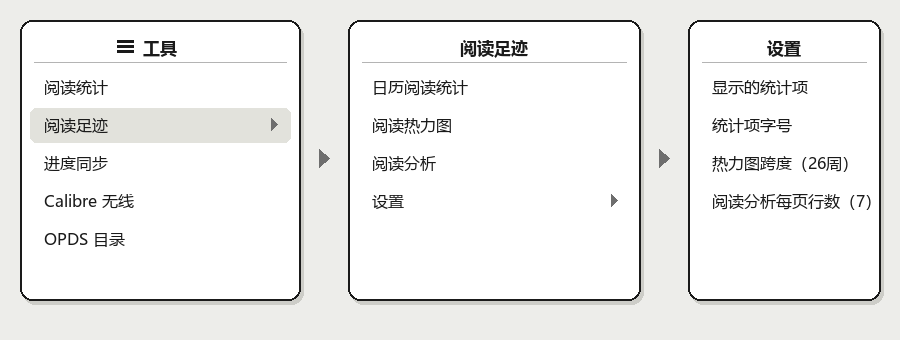
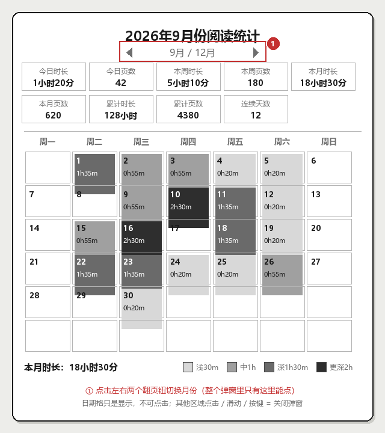
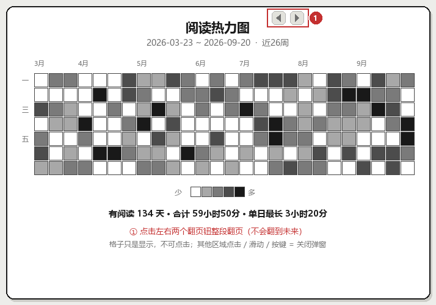
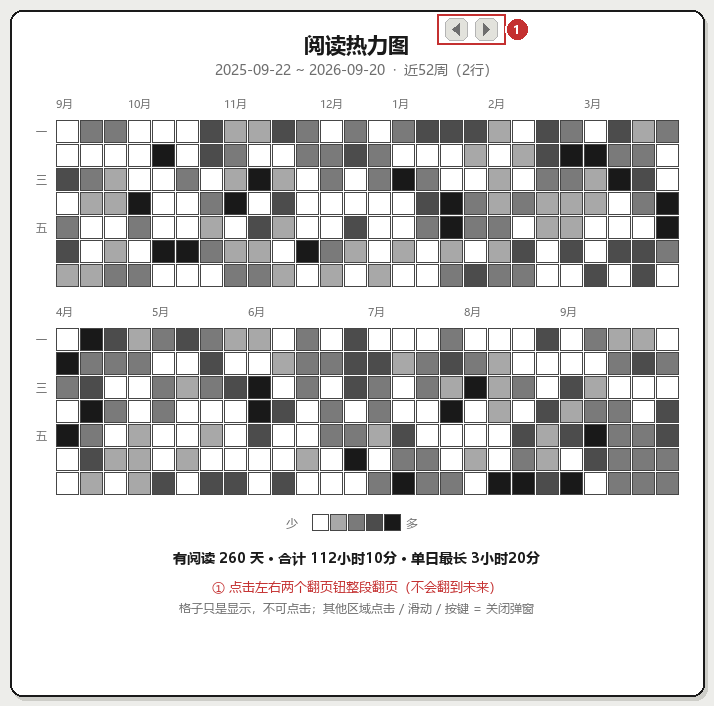
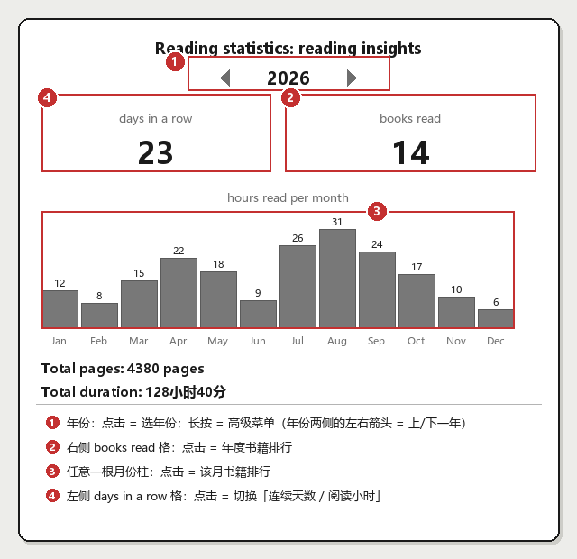
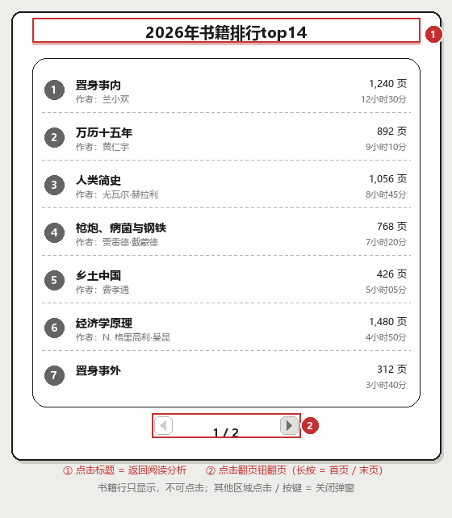
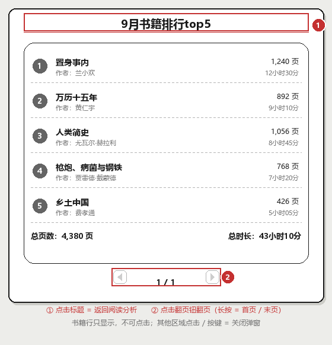
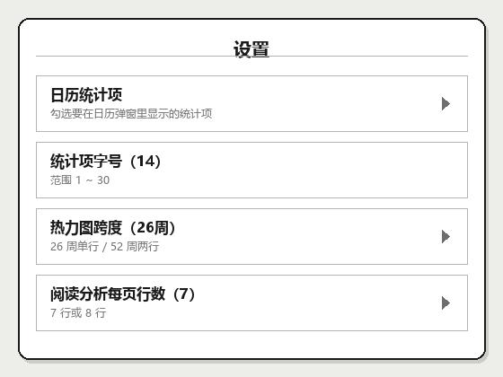

# 轻量版阅读统计 · 阅读足迹（readingstats.koplugin）

> KOReader 插件 —— 把阅读记录变成一张看得见的图。
> 菜单进入，无需手势；日历热力图 + GitHub 风格全年贡献图 + 阅读分析，三视图并存。

**「轻量版」是什么意思**：相对 KOReader 内置的 **「阅读统计」** 插件，本插件只做
「看图」这一件事 —— 不接管阅读器统计逻辑、不改阅读界面、不加手势、不常驻后台。
它只是在菜单里多一个入口，点开就读 `statistics.sqlite3` 画三张图，关掉即退出。

由三份 KOReader user patch（① 日历阅读统计 ② 阅读小票 ③ 阅读分析）改造而来，
现保留 **① 日历阅读统计** 与 **③ 阅读分析**，并新增移植自
[inkstain.koplugin](https://github.com/Estela-Zelin84/inkstain.koplugin) 的
**GitHub 风格阅读热力图**。

- 项目名：**轻量版阅读统计 · 阅读足迹**
- 菜单里显示的名字：**阅读足迹**（在内置「阅读统计」下面）
- 目录 / 内部名：`readingstats.koplugin`

[](https://github.com/seaneasysaid/lightweight-reading-stats/releases/latest)
[](https://github.com/seaneasysaid/lightweight-reading-stats/releases/latest)

---

## 功能

| 视图 | 说明 |
| --- | --- |
| **日历阅读统计** | 月历形式，每格显示日期 + 当日时长，背景 4 级灰。`◀ ▶` 翻月，底部显示本月时长与图例。 |
| **阅读热力图** | 标准 GitHub 贡献图：周为列、周一~周日为行，5 级灰阶。`◀ ▶` 整段翻页，可选 26 周（单行）或 52 周（两行）。 |
| **阅读分析** | 按年统计：年度总览、12 个月柱状图，可下钻到**年度 / 月度书籍排行**。 |
| **设置** | 日历统计项显示开关、统计项字号、热力图跨度、阅读分析每页行数。 |

---

## 界面

### 菜单入口

顶部菜单 → ☰ 工具 → **阅读足迹**（就在内置「阅读统计」下面）。



层级：`☰ 工具` → `阅读足迹` → `日历阅读统计 / 阅读热力图 / 阅读分析 / 设置`

### ① 日历阅读统计



### ② 阅读热力图 · 26 周（单行铺满）



### ② 阅读热力图 · 52 周（拆成两行，每行 26 周）



### ③ 阅读分析

红框 = 可点击的地方，编号对应下方图例。



### ③-1 年度书籍排行（点「books read」进入）



### ③-2 月度书籍排行（点某根月份柱进入）



### 设置



---

## 哪里可以点，点了会怎样

### 菜单

| 位置 | 操作 | 结果 |
| --- | --- | --- |
| ☰ 工具 → **阅读足迹** | 点击 | 展开子菜单 |
| 日历阅读统计 | 点击 | 打开月历弹窗 |
| 阅读热力图 | 点击 | 打开热力图窗口 |
| 阅读分析 | 点击 | 打开年度分析弹窗 |
| 设置 | 点击 | 展开设置子菜单 |
| 设置 → 日历统计项 | 点击 | 展开勾选列表；勾选决定日历弹窗里显示哪几项统计 |
| 设置 → 统计项字号 | 点击 | 数值调节 1 ~ 30 |
| 设置 → 热力图跨度 | 点击 | 在 **26 周** / **52 周** 之间切换 |
| 设置 → 阅读分析每页行数 | 点击 | 在 **7 行** / **8 行** 之间切换 |

### ① 日历阅读统计 —— 整个弹窗只有翻页钮能点

| 位置 | 操作 | 结果 |
| --- | --- | --- |
| 标题两侧的 **◀ ▶** | 点击 | 上一个月 / 下一个月 |
| 日期格子 | — | **不可点击**，只负责显示（当天有阅读才画灰底 + 时长） |
| 其他任意位置 | 点击 / 上下左右滑动 / 按键 | 关闭弹窗 |

### ② 阅读热力图 —— 只有翻页钮能点

| 位置 | 操作 | 结果 |
| --- | --- | --- |
| 标题右侧的 **◀ ▶** | 点击 | 整段向前 / 向后翻一屏（**不会翻到未来**） |
| 格子 | — | **不可点击**，只负责显示 |
| 其他任意位置 | 点击 / 滑动 / 按键 | 关闭弹窗 |

### ③ 阅读分析 —— 4 个热区

对应上面第二张图里的红框编号：

| 编号 | 位置 | 操作 | 结果 |
| --- | --- | --- | --- |
| ① | 年份数字（如 `2026`） | 点击 | 弹出**年份列表**（跨越多个年份时才有），点哪年跳哪年 |
| ① | 年份数字 | **长按** | 弹出**高级菜单**：检查新统计 / 强制重载连续天数 / 强制重载当年分析 |
| ① | 年份两侧的 ◀ ▶ | 点击 | 上一年 / 下一年 |
| ② | 右侧格 **books read** | 点击 | 打开 **当年书籍排行**（如「2026年书籍排行top14」） |
| ③ | 任意一根月份柱 | 点击 | 打开 **该月书籍排行**（如「9月书籍排行top5」） |
| ④ | 左侧格 **days in a row** | 点击 | 在「连续天数」与「阅读小时」两种口径之间切换 |
| — | 屏幕空白处 | 左右滑动 | 等价于上一年 / 下一年 |
| — | 屏幕 | 其他方向滑动 / 点击空白 / 按键 | 关闭弹窗 |

> 注意：**月份标签本身不可点**，要点柱状图的柱子；柱子只有当月有数据才可点。

### ③-1 / ③-2 书籍排行弹窗

| 位置 | 操作 | 结果 |
| --- | --- | --- |
| 标题 | 点击 | 关闭本弹窗，**回到「阅读分析」** |
| **◀** | 点击 | 上一页 |
| **◀** | 长按 | 直接跳到**第一页** |
| **▶** | 点击 | 下一页 |
| **▶** | 长按 | 直接跳到**最后一页** |
| 书名列（书名 / 作者 / 页数 / 时长） | — | **不可点击**，只负责显示 |
| 其他位置 | 点击 / 按键 | 关闭弹窗 |

最后一页底部会多出一行汇总：**总页数 / 总时长**。

每行显示：排名圆标 · 书名 · 作者 · 累计页数 · 累计时长。

---

## 安装

**方式一：下载 Release 压缩包（推荐）**

1. 到 [Releases](https://github.com/seaneasysaid/lightweight-reading-stats/releases/latest)
   下载 `readingstats.koplugin.zip`（或点上面的徽章）。
2. 解压得到 `readingstats.koplugin/` 目录（zip 里已带这层目录，直接解压即可）。
3. 把整个目录拷进设备的 KOReader 插件目录：

   | 设备 | 路径 |
   | --- | --- |
   | Kindle | `<USB 盘符>/koreader/plugins/` |
   | Kobo | `<USB 盘符>/.adds/koreader/plugins/` |
   | Android | `/sdcard/koreader/plugins/` |

4. **彻底重启 KOReader**（退出再进，不是回书架）。
5. 顶部菜单 → ☰ → **阅读足迹**。

**方式二：直接取源码**

1. 下载仓库里的 `readingstats.koplugin/` 整个目录（5 个 `.lua` 文件），后续步骤同上。

卸载：直接删掉 `readingstats.koplugin/` 目录并重启。

---

## 热力图实现说明

- **5 级灰阶**：`168 / 122 / 76 / 25`，颜色过渡对齐 inkstain 真实渲染效果。
- **p90 分位归一化**：取有阅读天数时长的 90 分位作为上限（下限 60 秒），
  再按 25 / 50 / 75 / 100% 四分位分级。避免某天读爆把整张图拉平。
- **周一对齐**：网格起始日对齐到周一，第 `i` 天即第 `i % 7` 行。
- **未来日期留白**：今天之后的格子不画边框，不与「没读」混淆。
- **52 周自动分两行**：每行 26 周，格子尺寸与 26 周模式一致，横向铺满窗口。
  跨行处月份标签去重，不会重复出现同一个月。
- 原始实现画在 PNG 壁纸上，本插件改为**屏幕控件绘制**，因此可交互、可翻页。

> 上游 inkstain 的灰阶表有 5 项，但取值用 `[level+1]` 且 `level 0` 提前返回白色，
> 所以 `0.16` 那项实际是死代码。本插件按它**真实渲染效果**对齐，不是照抄数组。

---

## 兼容性

- KOReader 2024.x ~ 2026.x
- 已在 Kindle（改装版）、Kobo、Android（MuMu 模拟器）上实测
- 若设备装了 SimpleUI 等定制底栏，点底栏「设置」可能唤不出菜单，
  请改用**菜单键**或**顶部下滑手势**

---

## 目录结构

```
readingstats.koplugin/
├── main.lua              # 插件入口：菜单注入、设置
├── _meta.lua             # 插件元信息
├── calendar_stats.lua    # ① 日历阅读统计
├── heatmap_view.lua      # ② 阅读热力图（移植自 inkstain）
└── reading_insights.lua  # ③ 阅读分析 + 书籍排行
```

---

## 许可

MIT
